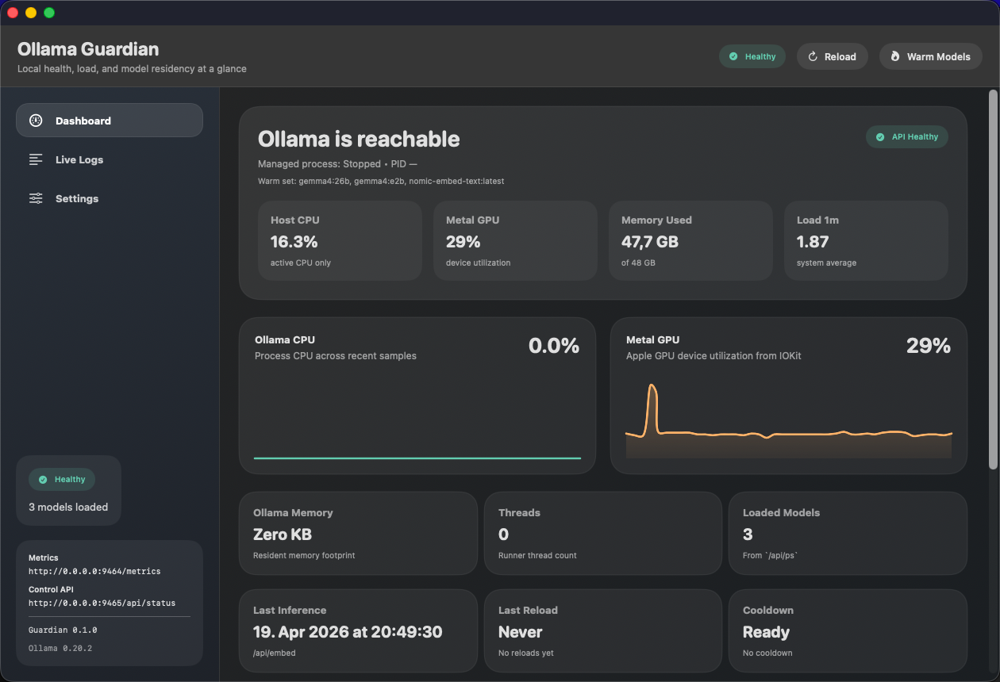
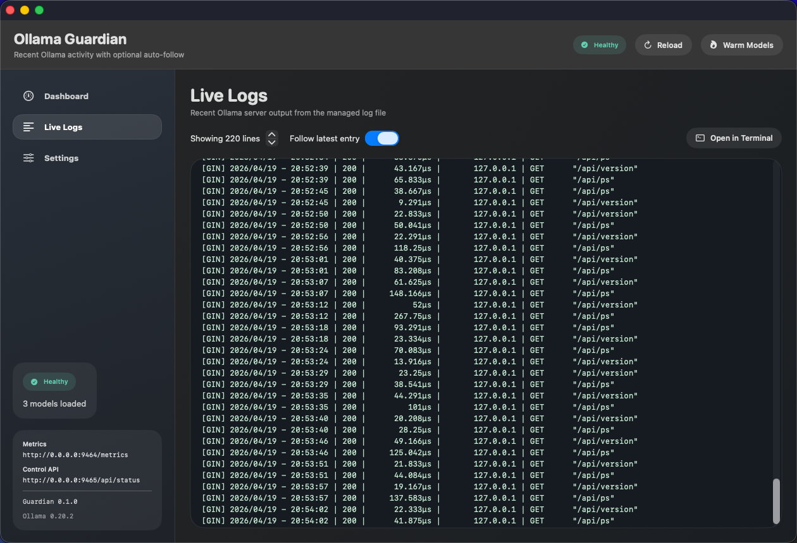

# Ollama Guardian

Native macOS control plane for a local Ollama node.

Ollama Guardian keeps a shared Ollama runtime healthy on macOS by monitoring the host, watching Ollama API/log activity, detecting stuck states, restarting and rewarming models when needed, exposing Prometheus metrics, and offering a small authenticated remote-ops API for automation or AI-SRE workflows.

## Screenshots





## What It Does

- Runs as a menu bar app with a unified dashboard window.
- Manages `ollama serve` directly instead of relying on a wrapper proxy.
- Monitors host CPU, Metal GPU utilization, memory, load average, Ollama process stats, API health, and log-derived inference activity.
- Detects likely stuck-runtime conditions and can reload Ollama automatically.
- Warms a configurable model set after startup or reload.
- Exposes Prometheus metrics on a configurable network bind host and port.
- Exposes a bearer-protected control API for restart, warmup, cooldown clearing, status, and recent logs.
- Shows actionable recovery guidance instead of crashing when required runtime pieces are missing or misconfigured.

## Defensive Behavior

Ollama Guardian now fails softly and tells the operator what to do next when:

- `ollama` is not installed or not on `PATH`
- the managed log path is not writable
- the Ollama API never becomes healthy
- the metrics or control API port is already in use
- required settings such as ports or bearer token are invalid

The app surfaces these as clear in-app recovery cards and keeps the control plane itself alive.

## Requirements

- macOS 14 or later
- Ollama installed locally
- Command Line Tools for Xcode for command-line builds

Recommended Ollama install options:

```bash
brew install ollama
```

Or install Ollama from the official app/download and verify:

```bash
ollama --version
```

## Install

### Option 1: Download the app bundle

1. Download the latest `Ollama Guardian.app` from the GitHub Releases page.
2. Move it to `/Applications`.
3. Launch the app.
4. Open `Settings` and confirm your Ollama host, ports, warm models, and control token.

### Option 2: Build from source

```bash
git clone <your-repo-url>
cd ollama-guardian
swift build
./scripts/package-app.sh
open ".build/apple/Ollama Guardian.app"
```

To install the packaged build into `/Applications`:

```bash
cp -R ".build/apple/Ollama Guardian.app" /Applications/
open "/Applications/Ollama Guardian.app"
```

## Configuration

The Settings view exposes the practical Ollama server/runtime options for a guardian-managed node, including:

- Ollama base URL, bind host, and port
- model storage directory and allowed origins
- keep-alive, context length, queueing, parallelism, and loaded-model limits
- load timeout, K/V cache type, LLM library override, and GPU overhead
- flash attention, debug logging, prune/cloud toggles, spread scheduling, and multi-user cache
- warm model list and endpoint type (`generate` or `embed`)
- watchdog thresholds
- Prometheus metrics bind host/port
- authenticated control API bind host/port and bearer token generation

Every option has inline hover help in the UI.

## Prometheus Metrics

The metrics server exposes:

- `GET /health`
- `GET /metrics`

Example scrape target:

```text
http://0.0.0.0:9464/metrics
```

Key exported metrics include:

- `ollama_guardian_system_cpu_percent`
- `ollama_guardian_system_gpu_percent`
- `ollama_guardian_system_load_1m`
- `ollama_guardian_ollama_cpu_percent`
- `ollama_guardian_ollama_resident_memory_bytes`
- `ollama_guardian_loaded_models`
- `ollama_guardian_api_healthy`
- `ollama_guardian_last_inference_timestamp_seconds`
- `ollama_guardian_last_reload_timestamp_seconds`
- `ollama_guardian_stuck_state`

## Remote Control API

The control API is exposed on its own bind host and port and requires:

```http
Authorization: Bearer <token>
```

Available endpoints:

- `GET /api/status`
- `POST /api/actions/restart`
- `POST /api/actions/warm`
- `POST /api/actions/clear-cooldown`
- `GET /api/logs/recent?lines=50`

## Verification

This repo includes a runnable verification harness in `Tests/VerificationRunner.swift`.

Run it with:

```bash
./scripts/run-tests.sh
```

That script compiles a standalone verification runner against the real runtime sources and currently checks:

- settings persistence
- log endpoint parsing
- stuck-state detection rules
- HTTP bearer parsing
- executable discovery
- configuration validation
- missing-Ollama recovery guidance

## Project Layout

```text
Sources/local-ollama-monitor/
  AppMain.swift
  GuardianController.swift
  HTTPServer.swift
  Diagnostics.swift
  Models.swift
  OllamaRuntime.swift
  SettingsStore.swift
  Support.swift
  Views.swift

scripts/
  package-app.sh
  run-tests.sh

docs/screenshots/
  dashboard.png
  live-logs.png
```

## License

MIT. See [LICENSE](LICENSE).
